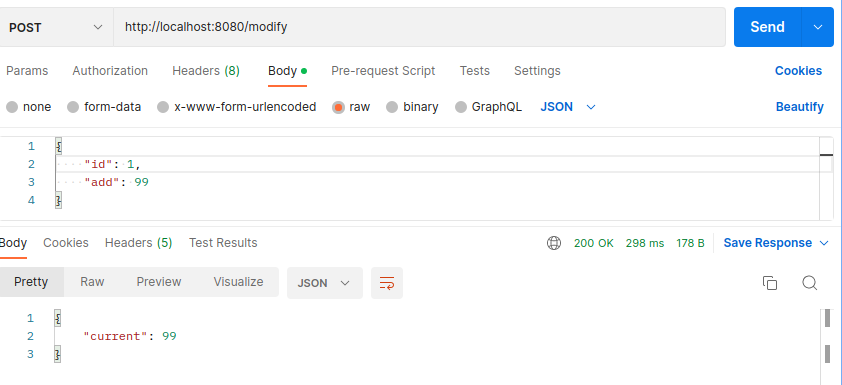
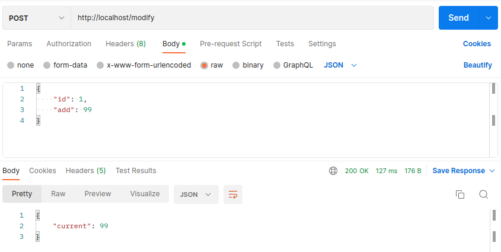

# super kassa test
Тестовое задание супер-касса

# Требования
- Spring приложение с обработкой POST запроса по урлу /modify
- В случае невозможности провести операцию, вернуть http статус 418.

# Локальный запуск
- Склонировать репозиторий и открыть проект
- Запустить docker conteiner с postgresql командой: база поднимется на порту 6664

      bash ./postgres-run.sh

- Собрать проект командой

      mvn clean install

- Запустить проект командой

      mvn spring-boot:run -Dspring-boot.run.profiles=local

- Либо установить активный профиль = local и запусть прямо из IDEA

# Docker-compose 
- Склонировать репозиторий и открыть проект
- Из коневой папки запустить команду

      docker-compose up -d

- Дождаться запуска всех контейнеров

# Тестирование приложения (Локальный запуск)
- Для вычисления результата необходимо отправить POST запрос на адрес localhost:8080/modify
  

# Тестирование приложения (Docker-compose)
- Для вычисления результата необходимо отправить POST запрос на адрес localhost/modify
  

